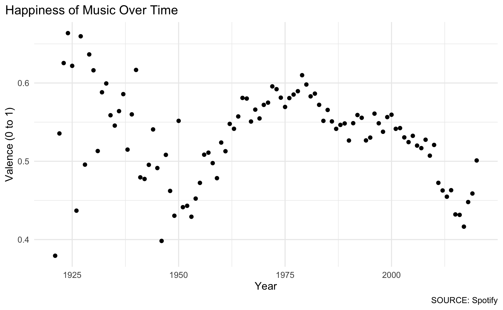
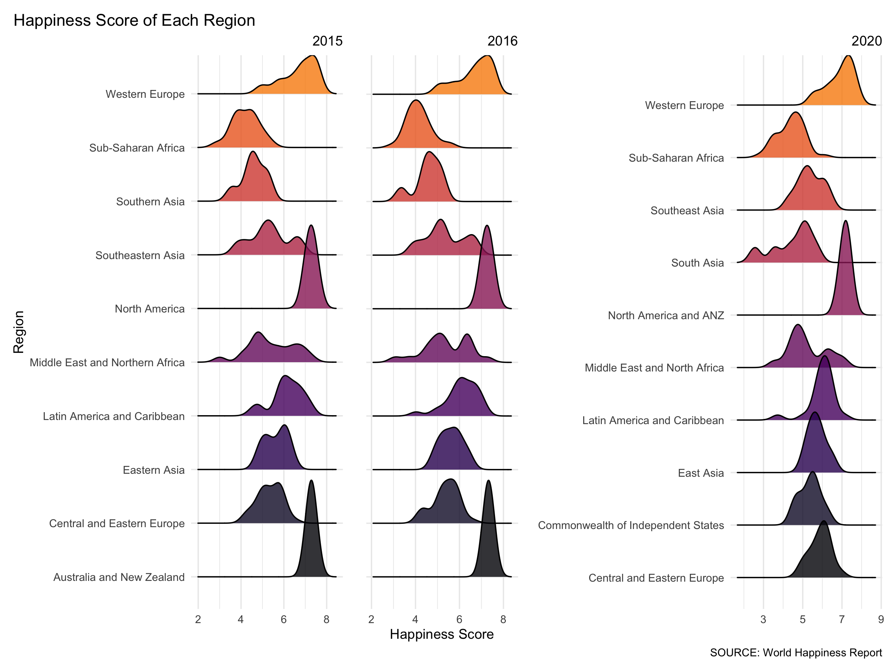
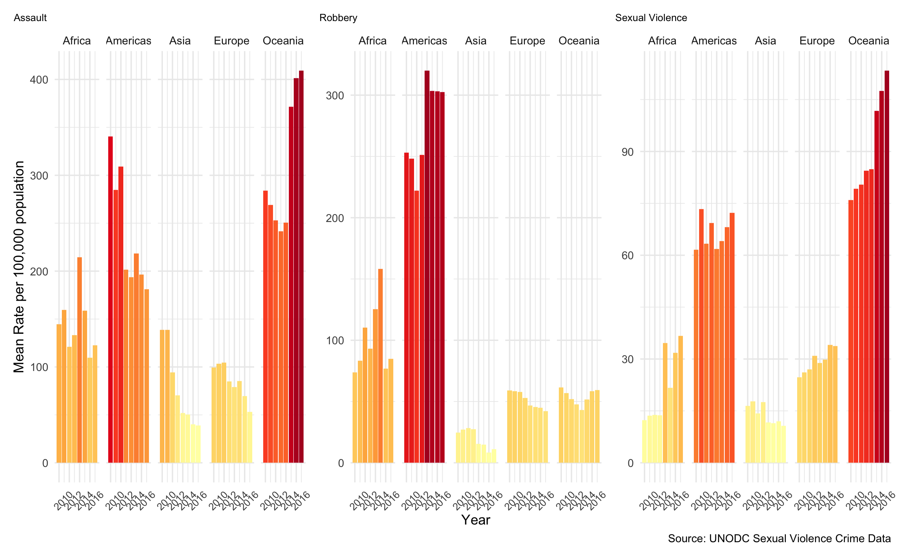
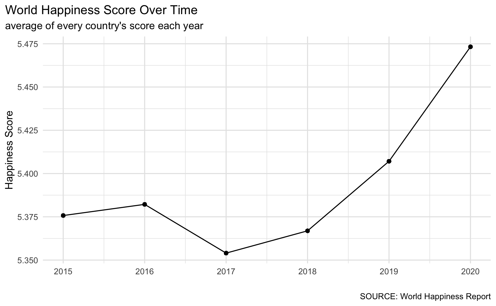
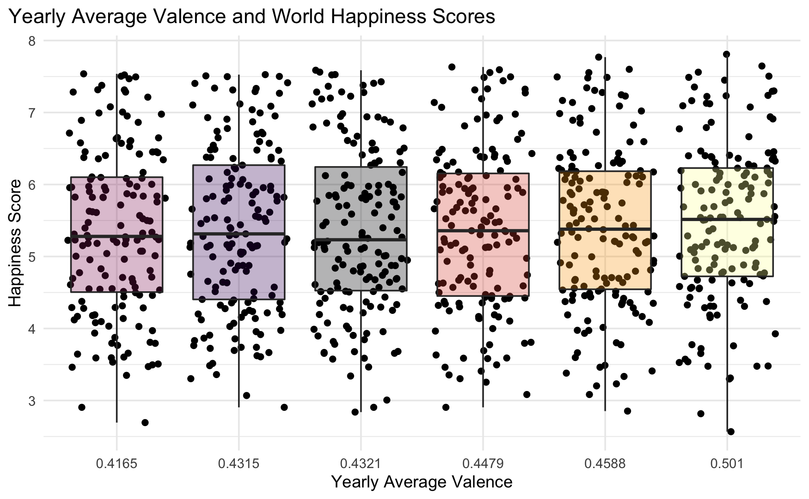
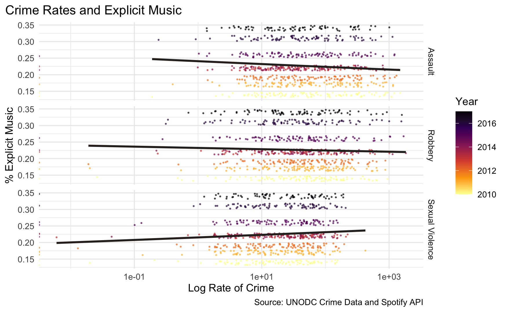

# Xaringan presentation

(Need to install the `xaringan` package)

+ [About](https://bookdown.org/yihui/rmarkdown/xaringan.html)
+ [Themes here](https://github.com/yihui/xaringan/wiki/Themes)
+ Want to get fancy with a custom theme? Try [xaringan themer](https://pkg.garrickadenbuie.com/xaringanthemer/articles/xaringanthemer.html)
+ Style edits: google "how to ______ in xaringan"

**Difference:** slides are broken up with `---`

---
# Introduction

<iframe width="560" height="315" src="https://www.youtube.com/embed/rnUSNbqtVJI" frameborder="0" allow="accelerometer; autoplay; clipboard-write; encrypted-media; gyroscope; picture-in-picture" allowfullscreen></iframe>

Music has strong effects on the brain, specifically on: memory, movement, and emotions. Is it possible to see trends between music and happiness, and music and crime?

---
# Music Dataset

| Variable         | Type | Description                                                         | Example    |
|------------------|------|---------------------------------------------------------------------|------------|
| mode             | int  | whether progression of track is major (1) or minor (0)              | 1          |
| year             | int  | the year                                                            | 2020       |
| acousticness     | num  | relative metric of track being acoustic                             | 0.2199309  |
| danceability     | num  | relative measurement of track being danceable                       | 0.6929043  |
| duration_ms      | num  | length of track in milliseconds                                     | 193728.4   |
| energy           | num  | energy of track                                                     | 0.6312316  |
| instrumentalness | num  | relative ratio of track being instrumental                          | 0.01637552 |
| liveness         | num  | relative duration of track sounding as a live performance           | 0.1785354  |
| loudness         | num  | relative loudness of track in the typical range [-60, 0] in decibel | -6.595067  |
| speechiness      | num  | relative length of track containing any kind of human voice         | 0.14138369 |
| tempo            | num  | overall estimated tempo of a track in beats per minute              | 124.2831   |
| valence          | num  | describes the musical positiveness conveyed by a track              | 0.5010478  |
| popularity       | num  | popularity                                                          | 64.3019704 |
| key              | int  | key track is in                                                     | 1          |

---
# World Happiness Dataset

| Variable                      | Type | Description                                                                                            | Example        |
|-------------------------------|------|--------------------------------------------------------------------------------------------------------|----------------|
| Country                       | chr  | country                                                                                                | Switzerland    |
| Region                        | chr  | region country is located in                                                                           | Western Europe |
| Happiness.Rank                | int  | ranking by happiness score                                                                             | 1              |
| Happiness.Score               | num  | happiness score [0, 10]                                                                                | 7.587          |
| Standard.Error                | num  | standard error of happiness score                                                                      | 0.03411        |
| Economy..GDP.per.Capita.      | num  | is in terms of Purchasing Power Parity                                                                 | 1.39651        |
| Family                        | num  | family and social support                                                                              | 1.34951        |
| Health..Life.Expectancy.      | num  | healthy life expectancy at birth                                                                       | 0.94143        |
| Freedom                       | num  | freedom to make life choices                                                                           | 0.66557        |
| Trust..Government.Corruption. | num  | perceptions of corruption                                                                              | 0.41978        |
| Generosity                    | num  | generosity of people in the country                                                                    | 0.29678        |
| Dystopia.Residual             | num  | relative to a hypothetical country called “Dystopia” (with lowest national averages of previous years) | 2.51738        |
| year                          | int  | year                                                                                                   | 2015           |
| mean                          | num  | average happiness score                                                                                | 5.375734       |

---
# Crime Dataset

There are separate datasets for Assault, Robbery and Sexual Violence. All follow the same structure outlines below:

| Variable  | Type | Description                          | Example     |
|-----------|------|--------------------------------------|-------------|
| Region    | chr  | Continent in the world               | Africa      |
| Subregion | chr  | Geographic areas within continents   | East Africa |
| Country   | chr  | A country                            | Burundi     |
| Rate      | num  | Rate of crime per 100,000 population | 35.028      |
| Count     | int  | Total number of crime incidents      | 3039        |
| Year      | int  | Year                                 | 2010        |

---
# Exploring Spotify Dataset

```{r setup, include = FALSE}
knitr::opts_chunk$set(echo = FALSE, message = FALSE, warning = FALSE)

library(ggplot2)
library(ggthemes)
library(tidyverse)
library(dplyr)
library(maps)
library(plotly)
library(readr)
library(ggridges)
#library(xaringanthemer)

#style_mono_accent(
  #base_color = "#43418A"
#)

theme_proj = theme_minimal() + 
  theme(plot.title.position = "plot")

#loading data
#data is cleaned in ATABAS_HUANG_dataCleaning.Rmd and loaded here
spotify <- read.csv("data/data.csv")
spotify_by_year <- read.csv("data/data_by_year.csv")
happiness <- read.csv("data/happiness.csv")
robbery <- read.csv("data/robbery.csv")
assault <- read.csv("data/assault.csv")
sexualviolence <- read.csv("data/sexualviolence.csv")
all_together <- read.csv("data/alltogether.csv")

```

```{r scatter, out.width="70%", dpi = 150, include = FALSE}
ggplot(data = spotify_by_year) +
  geom_point(mapping = aes(x = year, y = valence)) +
  labs(title = "Happiness of Music Over Time",
       x = "Year",
       y = "Valence (0 to 1)",
       caption = "SOURCE: Spotify") +
  theme_proj 
```

```{r, out.width="85%"}

```
---
# Exploring Happiness Dataset

```{r happy-load}
country_code <- read_csv("data/wikipedia-iso-country-codes.csv")
happiness_2015 <- read.csv("data/2015.csv") %>% mutate(year = 2015)
happiness_2016 <- read.csv("data/2016.csv") %>% mutate(year = 2016)
happiness_2017 <- read.csv("data/2017.csv") %>% mutate(year = 2017)
happiness_2018 <- read.csv("data/2018.csv") %>% mutate(year = 2018)
happiness_2019 <- read.csv("data/2019.csv") %>% mutate(year = 2019)
happiness_2020 <- read.csv("data/2020.csv") %>% mutate(year = 2020)

colnames(happiness_2017) = c("Country", "Happiness.Rank", "Happiness.Score",
                             "Upper.Confidence.Interval", "Lower.Confidence.Interval",
                             "Economy..GDP.per.Capita.", "Family", "Health..Life.Expectancy.",
                             "Freedom", "Generosity", "Trust..Government.Corruption.",
                             "Dystopia.Residual", "year")

colnames(happiness_2018) = c("Happiness.Rank", "Country", "Happiness.Score",
                             "Economy..GDP.per.Capita.", "Family", "Health..Life.Expectancy.",
                             "Freedom", "Generosity", "Trust..Government.Corruption.",
                             "year")

colnames(happiness_2019) = c("Happiness.Rank", "Country", "Happiness.Score",
                             "Economy..GDP.per.Capita.", "Family", "Health..Life.Expectancy.",
                             "Freedom", "Generosity", "Trust..Government.Corruption.",
                             "year")

colnames(happiness_2020) = c("Country", "Region", "Happiness.Score", "Standard.Error",
                             "Upper.Confidence.Interval", "Lower.Confidence.Interval",
                             "Logged.GDP.per.capita", "Family", "Healthy.life.expectancy",
                             "Freedom", "Generosity", "Trust..Government.Corruption.",
                             "Ladder.score.in.Dystopia", "Explained.by..Log.GDP.per.capita",
                             "Explained.by..Social.support",
                             "Explained.by..Healthy.life.expectancy",
                             "Explained.by..Freedom.to.make.life.choices",
                             "Explained.by..Generosity",
                             "Explained.by..Perceptions.of.corruption",
                             "Dystopia.Residual", "year")

happiness_2018 <- happiness_2018[-20,]
happiness_2018 <- happiness_2018 %>% mutate(Trust..Government.Corruption. =
                                              as.numeric(Trust..Government.Corruption.))

happiness_2015 <- happiness_2015 %>% mutate(mean = mean(Happiness.Score))
happiness_2016 <- happiness_2016 %>% mutate(mean = mean(Happiness.Score))
happiness_2017 <- happiness_2017 %>% mutate(mean = mean(Happiness.Score))
happiness_2018 <- happiness_2018 %>% mutate(mean = mean(Happiness.Score))
happiness_2019 <- happiness_2019 %>% mutate(mean = mean(Happiness.Score))
happiness_2020 <- happiness_2020 %>% mutate(mean = mean(Happiness.Score))

happiness <- happiness_2015 %>% bind_rows(happiness_2016) %>% bind_rows(happiness_2017) %>%
  bind_rows(happiness_2018) %>% bind_rows(happiness_2019) %>% bind_rows(happiness_2020)
```
```{r happy-ridges, fig.height = 3, fig.width = 4, dpi = 150, include= FALSE}
library(patchwork)
#happiness_ridges <- happiness %>% filter(year == 2015 | year == 2016 | year == 2020)
happiness_2015 <- rbind(happiness_2015, happiness_2015[rep(5, 1), ])
happiness_2015 <- rbind(happiness_2015, happiness_2015[rep(15, 1), ])
happiness_2015 <- rbind(happiness_2015, happiness_2015[rep(9, 1), ])
happiness_2015 <- rbind(happiness_2015, happiness_2015[rep(10, 1), ])

happiness_2016 <- rbind(happiness_2016, happiness_2016[rep(6, 1), ])
happiness_2016 <- rbind(happiness_2016, happiness_2016[rep(13, 1), ])
happiness_2016 <- rbind(happiness_2016, happiness_2016[rep(8, 1), ])
happiness_2016 <- rbind(happiness_2016, happiness_2016[rep(9, 1), ])
  
plot0 <- ggplot(happiness_2015, aes(y = Region, x = Happiness.Score, fill = Region)) + 
  geom_density_ridges(alpha = .8) +
  scale_fill_viridis_d(end = .75, option = "B") + 
  scale_color_viridis_d(end = .75, option = "B") + 
  theme_proj +
  theme(legend.position = "none",
        plot.subtitle = element_text(hjust = 1)) +
  labs(title = "Happiness Score of Each Region",
       subtitle = "2015",
       y = "Region",
       x = element_blank())

plot1 <- ggplot(happiness_2016, aes(y = Region, x = Happiness.Score, fill = Region)) +
  geom_density_ridges(alpha = .8) +
  scale_fill_viridis_d(end = .75, option = "B") +
  scale_color_viridis_d(end = .75, option = "B") +
  theme_proj +
  theme(legend.position = "none",
        axis.text.y = element_blank(),
        plot.subtitle = element_text(hjust = 1)) +
  labs(subtitle = "2016",
       y = element_blank(), 
       x ="Happiness Score")

plot2 <- ggplot(happiness_2020, aes(y = Region, x = Happiness.Score, fill = Region)) +
  geom_density_ridges(alpha = .8) +
  scale_fill_viridis_d(end = .75, option = "B") +
  scale_color_viridis_d(end = .75, option = "B") +
  theme_proj +
  theme(legend.position = "none",
        plot.subtitle = element_text(hjust = 1))+
  labs(subtitle = "2020",
       caption = "SOURCE: World Happiness Report",
       y = element_blank(), 
       x = element_blank())

plot0 + plot1 + plot2
```
```{r, out.width="85%"}

```

---

```{r happy-map, out.width = "100%"}
#loading dataset of each country's ISO code (because plotly needs it to map countries)
# source: https://www.kaggle.com/andradaolteanu/iso-country-codes-global

#joining together happiness and country_code dataset
happiness_plotly <- left_join(country_code, happiness, by = c("English short name lower case" = "Country"))

#renaming the happiness dataset variables
colnames(happiness_plotly) = c("Country", "two.code", "three.code", "Numeric.code", "ISO",
                        "Region", "Happiness.Rank", "Happiness.Score", "Standard.Error",
                        "Economy..GDP.per.Capita.", "Family", "Health..Life.Expectancy.",
                        "Freedom", "Trust..Government.Corruption.", "Generosity",
                        "Dystopia.Residual", "year", "mean", "Lower.Confidence.Interval",
                        "Upper.Confidence.Interval", "Logged.GDP.per.capita",
                        "Healthy.life.expectancy", "Ladder.score.in.Dystopia",
                        "Explained.by..Log.GDP.per.capita", "Explained.by..Social.support",
                        "Explained.by..Healthy.life.expectancy",
                        "Explained.by..Freedom.to.make.life.choices",
                        "Explained.by..Generosity",
                        "Explained.by..Perceptions.of.corruption")

#"hover" variable: this specifies what info is displayed when you hover over a country
happiness_plotly <- happiness_plotly %>% mutate(hover = paste0(Country, "\nHappiness Rank: ", Happiness.Rank, "\nHappiness Score: ", Happiness.Score))

#hover label aesthetics
fontStyle <- list(family = "Arial", size = 15, color = "black")
label <- list(bgcolor = "#EEEEEE", bordercolor = "transparent", font = fontStyle)

#plotly map!
p1 <- plot_geo(happiness_plotly, locationmode = "world", frame = ~year) %>%
  add_trace(locations = ~three.code,
            z = ~Happiness.Score,
            zmin = 2,
            zmax = 8,
            color = ~Happiness.Score,
            colorscale = "Electric", #changes color of scale (other options: RdBu, Viridis, Rainbow)
            text = ~hover, #displays info in "hover" variable we made above
            hoverinfo = "text") %>% #makes hover info the text from above line
  layout(font = list(family = "Arial"), title = "World Happiness Report \n 2015 - 2020") %>%
  style(hoverlabel = label) #%>%
  #config(displayModeBar = FALSE) #hides the plotly toolbar in top right

p1

# credit to this tutorial: https://www.youtube.com/watch?v=RrtqBYLf404
```

---
# Exploring Crime Dataset

```{r crime-plots, fig.width = 4, dpi = 150, include = FALSE}

p1 <- assault %>%
  group_by(Year, Region) %>%
  summarise(
    means = mean(as.numeric(Rate), na.rm = TRUE)
  ) %>%
  ggplot() +
    geom_col(aes(x = Year, y = means, fill = means)) +
  theme_proj +
  scale_fill_distiller(palette = "YlOrRd", direction = 1) +
  #scale_fill_viridis_c(option = "B", direction = -1) +
  guides(fill = FALSE) +
  labs(x = element_blank(), y = "Mean Rate per 100,000 population",
       title = "Assault") +
  theme(plot.title = element_text(size = 8)) +
  theme(axis.text.x = element_text(size = 8, angle = 45, vjust = .1, hjust=.1)) +
  facet_grid(. ~ Region)

p2 <- robbery %>%
  group_by(Year, Region) %>%
  summarise(
    means = mean(as.numeric(Rate), na.rm = TRUE)
  ) %>%
  ggplot() +
    geom_col(aes(x = Year, y = means, fill = means)) +
  theme_proj +
  scale_fill_distiller(palette = "YlOrRd", direction = 1) +
  #scale_fill_viridis_c(option = "B", direction = -1) +
  guides(fill = FALSE) +
  labs(x = "Year", y = element_blank(),
       title = "Robbery") +
  theme(plot.title = element_text(size = 8)) +
  theme(axis.text.x = element_text(size = 8, angle = 45, vjust = .1, hjust=.1)) +
  facet_grid(. ~ Region)

p3 <- sexualviolence %>%
  group_by(Year, Region) %>%
  summarise(
    means = mean(as.numeric(Rate), na.rm = TRUE)
  ) %>%
  ggplot() +
    geom_col(aes(x = Year, y = means, fill = means)) +
  theme_proj +
  scale_fill_distiller(palette = "YlOrRd", direction = 1) +
  #scale_fill_viridis_c(option = "B", direction = -1) +
  guides(fill = FALSE) +
  labs(x = element_blank(), y = element_blank(),
       title = "Sexual Violence",
       caption = "Source: UNODC Sexual Violence Crime Data") +
  theme(plot.title = element_text(size = 8), 
        axis.text.x = element_text(size = 8, angle = 45, vjust = .1, hjust=.1)) +
  facet_grid(. ~ Region)

p1 + p2 + p3
```
```{r, out.width = "100%"}

```
---
# Happiness Over Time

```{r happy-time, out.width = "70%", include = FALSE}
ggplot(data = happiness) +
  geom_point(mapping = aes(x = year, y = mean)) +
  geom_line(mapping = aes(x = year, y = mean)) +
  labs(title = "World Happiness Score Over Time",
       subtitle = "average of every country's score each year",
       x = "",
       y = "Happiness Score",
       caption = "SOURCE: World Happiness Report") +
  theme_proj +
  #need to add gridlines because tufte removes them
  theme(panel.grid.major = element_line(color = "gray90"),
        panel.grid.minor = element_line(color = "gray90"))
```
```{r, out.width = "90%"}

```

---
# Comparisons

```{r happy-cor, out.width = "70%", dpi = 150, include = FALSE}
spotify_by_year_small <- spotify_by_year %>% filter(year == 2015 | year == 2016 | year == 2017 | year == 2018 | year == 2019 | year == 2020)

spotify_and_happiness <- left_join(spotify_by_year_small, happiness, by = c("year" = "year"))

#spotify_and_happiness 

ggplot(data = spotify_and_happiness, aes(x = as.factor(round(valence,4)), y = Happiness.Score)) +
  geom_jitter() +
  geom_boxplot(alpha= 0.3, aes(fill = year)) +
  scale_fill_viridis_c(option = "B") +
  guides(fill = FALSE) +
  labs(x = "Yearly Average Valence", y = "Happiness Score",
       title = "Yearly Average Valence and World Happiness Scores") +
  theme_proj
```
```{r, out.width = "90%"}

```

---
# Crime and Explicit Music

```{r regress-assault, out.width="70%", dpi = 150,include = FALSE}
all_together %>%
  ggplot(aes(x = Rate, y = perc_expl, color = year)) +
    geom_jitter(size = 0.3, alpha = 0.6) +
    geom_smooth(
    method = "glm", method.args = list(family = "binomial"), 
    color = "#2E2927", se = FALSE, size = 1
    ) +
    scale_color_viridis_c(option = "B", direction = -1) +
    #scale_color_distiller(palette = "YlOrRd", direction = 1) +
    facet_grid(type ~ ., scale = "free_x") +
    labs(x = "Log Rate of Crime", y = "% Explicit Music", 
         color = "Year", caption = "Source: UNODC Crime Data and Spotify API",
         title = "Crime Rates and Explicit Music") +
    scale_x_log10() +
    theme_proj
```
```{r, out.width = "90%"}

```

---
# Discussion

Limitations:
+ Limited data available 
+ Correlational study
+ Merging the datasets (no independence)

Future Works/Discussion:
+ Exploring more of the music variables
+ Predicting the next popular song
+ Finding crime data for U.S. only


